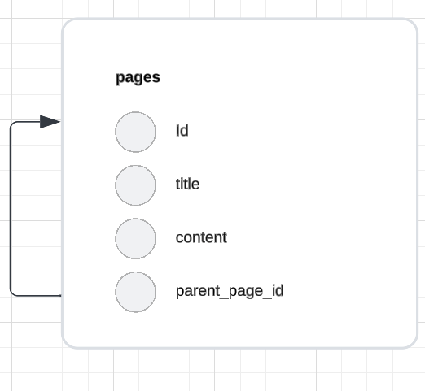

# Pages 테이블

Pages 테이블은 페이지 관리를 위한 정보를 저장합니다.

## 컬럼 목록

| 컬럼명         | 데이터 타입  | 기본값 | 설명                     |
| -------------- | ------------ | ------ | ------------------------ |
| page_id        | INT          |        | 고유한 페이지 ID         |
| title          | VARCHAR(255) |        | 페이지 제목              |
| content        | TEXT         |        | 페이지 컨텐츠            |
| parent_page_id | INT          | NULL   | 상위 페이지 ID (외래 키) |

## 외래 키

- parent_page_id: Pages(page_id) 참조

## ERD Diagram



```sql
with recursive cte (id, title, parent_page_id) as (
  select     id,
             title,
             parent_page_id
  from       pages
  where      id = 13
  union all
  select     pa.id,
             pa.title,
             pa.parent_page_id
  from       pages pa
  inner join cte
          on pa.parent_page_id = cte.id
)
select * from cte;
```

```sql
with recursive cte (id, title, parent_page_id) as (
  select     id,
             title,
             parent_page_id
  from       pages
  where      id = 13
  union all
  select     pa.id,
             pa.title,
             pa.parent_page_id
  from       pages pa
  inner join cte  on pa.parent_page_id = cte.id
)
select * from cte;
```

```sql
WITH RECURSIVE cte AS (

    -- id 13 인것 반환
    SELECT id, parent_page_id, content, title
    FROM pages
    WHERE id = 13

-- select 문 결과 집합을 결합
    UNION ALL

-- cte"와"pages"를 조인 (parent_page_id 와 id 같은것 찾음)
    SELECT p.id, p.parent_page_id, p.content, p.title
    FROM cte
    JOIN pages AS p ON cte.parent_page_id = p.id
)
SELECT id, title, content,parent_page_id
FROM cte;
```
